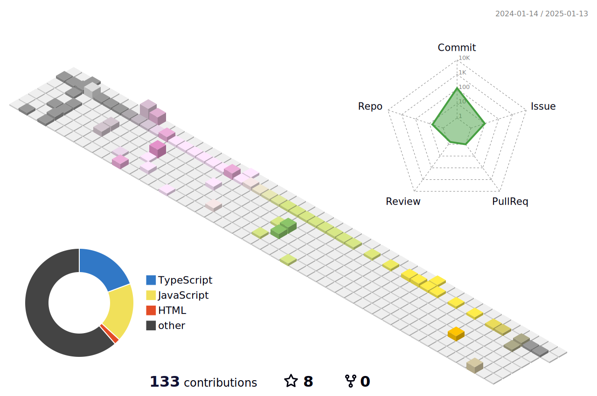

**Hibichann**

**Languages and Frameworks**

<code></code>
<code></code>
<code></code>
<code></code>
<code></code>
<code></code>
<code></code>
<code></code>
<code></code>
<code></code>
<code></code>
<code></code>
<code></code>
<code></code>
<code></code>

总访客次数: 
Visitor Count: 

  
<table style="width:100%;margin-top:30px" style="border:none">
  <tr style="border:none">
    <th style="border:none"></th>
    <th style="border:none"></th>
  </tr>
</table>

---

